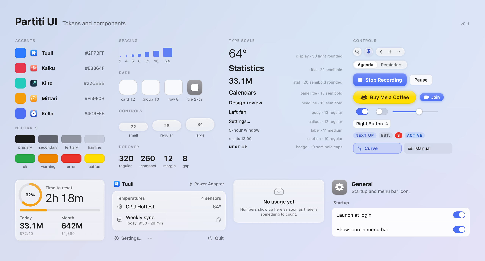
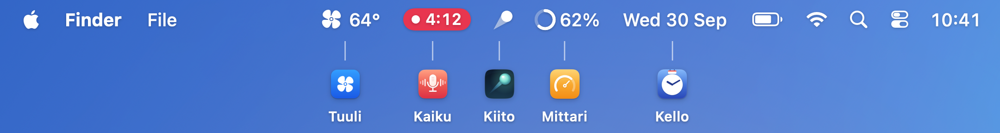

# Partiti UI

The shared design language of [Tuuli, Kaiku, Kiito, Mittari and Kello](https://apps.partiti.dev), five free menu bar apps for macOS. It is a small SwiftUI package with the design tokens, the glass materials and the components the apps are built from, so the five of them look like they come from the same hands.



## Principles

- **The system first.** Glass, controls and forms come from macOS as they are. Only what the system doesn't offer is drawn by hand.
- **One color per app.** The identity color marks primary actions, selection and active state only. Everything else stays neutral.
- **Same skeleton, different content.** Header, content and footer are the same everywhere; what goes inside belongs to each app.
- **Stable numbers.** Every value that changes uses monospaced digits; big numbers use SF Pro Rounded.
- **Light and accessible.** No continuous animation. Reduce Motion, Increase Contrast and Reduce Transparency are respected.

## Requirements

- macOS 14 or later. Liquid Glass is used on macOS 26 and later; see [Glass](#glass).
- Swift 6.2 (Xcode 26) or later.

## Installation

Add the package to `Package.swift`:

```swift
dependencies: [
    .package(url: "https://github.com/gabry-ts/partiti-ui", from: "0.2.0")
],
targets: [
    .target(name: "MyApp", dependencies: [.product(name: "PartitiUI", package: "partiti-ui")])
]
```

In Xcode, use File > Add Package Dependencies… with the same URL and add the `PartitiUI` library to the app target.

A change here reaches five apps, so depend on tagged versions and update deliberately rather than tracking `main`.

## Usage

Set the accent once, at the root of every popover and window. It feeds every Partiti UI component and sets the system tint for native controls.

```swift
import PartitiUI

struct MenuContent: View {
    var body: some View {
        PopoverScaffold {
            PopoverHeader(icon: Image("AppIcon"), name: "Kaiku") {
                GlassCircleButton("folder") { openRecordingsFolder() }
            }
        } content: {
            Card {
                VStack(alignment: .leading, spacing: PUI.Popover.rowGap) {
                    SectionHeader("Recent") { Text("4 calls") }
                    Row("Weekly sync", subtitle: "Today, 9:30 · 28 min",
                        leading: { RowSymbol("text.bubble") },
                        trailing: { EmptyView() })
                }
            }
        } footer: {
            PopoverFooter(
                actions: [.init("Recordings", symbol: "list.bullet.rectangle") { showRecordings() }],
                onSettings: { openSettings() },
                onCheckForUpdates: { updater.checkForUpdates() },
                onBuyMeACoffee: { openURL(coffeeURL) }) {
                // Optional: the app's own items at the top of the ⋯ menu.
                Toggle("Show Transcripts", isOn: $showsTranscripts)
            }
        }
        .puiAccent(.kaiku)
    }
}
```

The settings window is a floating sidebar and a pane. Give the window a full-size content view with a transparent title bar so the sidebar runs under the traffic lights.

```swift
struct SettingsView: View {
    @State private var selection = "general"
    @State private var checksAutomatically = true
    @State private var launchAtLogin = false

    // Localized titles take a stable id, so the selection doesn't change with the language.
    let sections = [
        SidebarSection(nil, [
            SidebarItem("General", id: "general", symbol: "gearshape.fill", style: .tile(.gray)),
            SidebarItem("Recording", id: "recording", symbol: "mic.fill", style: .tile(AppAccent.kaiku.color)),
            SidebarItem("About", id: "about", symbol: "info", style: .tile(.teal))
        ])
    ]

    var body: some View {
        SettingsWindow(sections: sections, selection: $selection) {
            switch selection {
            case "about":
                AboutPane(
                    brand: PartitiBrand(accent: .kaiku,
                                        tagline: String(localized: "Record and transcribe your calls"),
                                        coffeeLine: String(localized: "Kaiku is free. If it saves you some notes, you can buy me a coffee."),
                                        icon: Image("AppIcon")),
                    version: "Version 1.2 (34)",
                    checksAutomatically: $checksAutomatically,
                    onCheckForUpdates: { updater.checkForUpdates() },
                    onBuyMeACoffee: { openURL(coffeeURL) })
            default:
                SettingsPane {
                    PaneHeader("General", subtitle: "Startup and menu bar icon.", symbol: "gearshape.fill", color: .gray)
                } content: {
                    SettingsGroup("Startup") {
                        SettingsRow("Launch at login") {
                            // The row shows the title; the switch keeps it for VoiceOver.
                            Toggle("Launch at login", isOn: $launchAtLogin)
                                .toggleStyle(PUISwitchStyle(showsLabel: false))
                        }
                    }
                }
            }
        }
        .frame(minWidth: PUI.Window.settingsMin.width, minHeight: PUI.Window.settingsMin.height)
        .puiAccent(.kaiku)
    }
}
```

## Tokens

All tokens live under the `PUI` namespace. Measures in the apps should come from here rather than from literals.

### Accents

| App | `AppAccent` | Hex |
| --- | --- | --- |
| Tuuli | `.tuuli` | `#2F7BFF` |
| Kaiku | `.kaiku` | `#E8364F` |
| Kiito | `.kiito` | `#22CBBB` |
| Mittari | `.mittari` | `#F59E0B` |
| Kello | `.kello` | `#4C6EF5` |

`accent.legible(scheme)` deepens the accent by 18% in light mode for text and glyphs. Kiito and Mittari are bright enough that solid fills take a dark label (`prefersDarkLabel`).

Neutral inks (`Ink(scheme).primary`, `.secondary`, `.tertiary`, `.hairline`, `.fill`, and the semantic `.green`, `.orange`, `.red`) are resolved per color scheme, so live views and offscreen renders agree.

### Spacing, radii, controls

| `PUI.Space` | xxs | xs | s | m | l | xl | xxl |
| --- | --- | --- | --- | --- | --- | --- | --- |
| pt | 2 | 4 | 6 | 8 | 12 | 16 | 24 |

| `PUI.Radius` | Value | Used for |
| --- | --- | --- |
| `card` | 12 | Popover cards |
| `group` | 10 | Settings groups, primary button |
| `row` | 8 | Rows, hover highlights, chips |
| `popover` | 24 | The popover, concentric with cards (`card + margin`) |
| `window` | 20 | The settings window |
| `tile(side)` | 27% | Icon tiles |
| `concentric(outer, inset:)` | | A radius inset inside another, sharing its center |

| `PUI.Control` | Height |
| --- | --- |
| `small` | 22: round glass buttons, toolbar capsules |
| `regular` | 28: segmented controls, fields, secondary buttons |
| `large` | 34: the primary action, the Coffee capsule |

Popovers are `PUI.Popover.regular` (320) or `compact` (260, Kello) wide, with a 12 pt margin, 8 pt between cards and 12 pt inside them. Settings windows are `PUI.Window.settings` (720 × 520) or `dashboard` (1040 × 700) for apps with a dashboard page.

### Type

Fixed sizes, because menu bar popovers don't follow Dynamic Type.

| `PUI.Font` | Spec | Used for |
| --- | --- | --- |
| `display` | 30 light rounded, mono digits | The main number of a popover |
| `title` | 22 semibold | Page titles, the app name in About |
| `stat` | 20 semibold rounded, mono digits | Secondary values, stat tiles |
| `paneTitle` | 15 semibold | Settings pane header |
| `headline` | 13 semibold | App name in the popover, row titles |
| `body` | 13 regular | Row text |
| `callout` | 12 regular | Footer buttons, secondary text |
| `label` | 11 medium | Card and section labels |
| `caption` | 10 regular | Notes and details |
| `badge` | 10 semibold caps, 6% tracking | Badges and counters |
| `menuBar` | 13 medium, mono digits | Status item text |

For a status item drawn in AppKit with an attributed title, `PUI.Font.menuBarNSFont(size:)` returns the same font as an `NSFont` (medium, monospaced digits, 13 pt unless an app offers a larger reading):

```swift
button.attributedTitle = NSAttributedString(string: "Tue 30 Sep 12:30",
                                            attributes: [.font: PUI.Font.menuBarNSFont()])
```

### Motion

`PUI.Motion.spring(reduceMotion:)` for state changes (a short fade with Reduce Motion) and `PUI.Motion.hover` for hover feedback. `SegmentedPill` slides its selection with the spring and only fades it with Reduce Motion.

## Components

**Popover.** `PopoverScaffold`, `PopoverHeader`, `HeaderStatus`, `PopoverToolbar`, `PopoverFooter` (app actions, Settings…, the ⋯ menu with the app's own `menuItems`, Check for Updates… and Buy Me a Coffee…, Quit, with ⌘, and ⌘Q), `FooterButton`, `FooterLabel` (the footer look, for a footer built by hand or a menu label), `Card`, `SectionHeader`, `Row`, `RowSymbol`, `EmptyState`.

**Controls.** `GlassCircleButton`, `GlassCapsule` with `IconButton` and `IconMenu` (the same look, opening a menu), `SegmentedPill`, `PrimaryButtonStyle`, `SecondaryButtonStyle`, `JoinButton` (`.regular` 22 pt or `.compact` 18 pt), `CoffeeButton`, `PUISwitchStyle`, `PUISlider`, `PopUpField`, `CheckMark`, `Chip`, `Badge`, `TightLabelStyle`.

```swift
GlassCapsule {
    IconButton("magnifyingglass") { search() }
    IconMenu("plus") {
        Button("New Event") { newEvent() }
        Button("New Reminder") { newReminder() }
    }
    .disabled(!canCreate)
}
```

Controls follow `.disabled(_:)`: `IconButton`, `IconMenu`, `GlassCircleButton`, `FooterButton`, `PrimaryButtonStyle`, `SecondaryButtonStyle`, `JoinButton`, `PUISwitchStyle` and `PUISlider` read `isEnabled` from the environment and draw a faded, neutral look, so apps don't dim them by hand.

`PUISwitchStyle` hides its label with `labelsHidden()` on macOS 15 and later. On macOS 14, where the style can't read that setting, use `PUISwitchStyle(showsLabel: false)`, which works everywhere. Either way the label still names the switch for VoiceOver.

**Data.** `Meter`, `GaugeRing`, `BigNumber`, `StatTile`.

**Settings.** `SettingsWindow`, `SettingsSidebar` with `SidebarSection` and `SidebarItem`, `SettingsPane`, `PaneHeader`, `IconTile`, `SettingsGroup`, `SettingsRow`, `AboutPane` with `PartitiBrand`.

**Menu bar.** `MenuBarItem`, `MenuBarSymbol`, `MenuBarRing`, `MenuBarPill`.

**Materials.** `.puiGlass(_:tint:)` for controls, `.puiSurface(...)` for content cards, `.puiHoverHighlight(_:)`, `Hairline`, `Ink` and `Inked`.

Types that would clash with SwiftUI names carry a `PUI` prefix (`PUISwitchStyle`, `PUISlider`); modifiers added to `View` carry a `pui` prefix.



## Localization

Everything the library shows can be translated.

**Your strings.** Components that take a title (`Row`, `SectionHeader`, `SettingsGroup`, `SettingsRow`, `PaneHeader`, `EmptyState`, `FooterButton`, `PopoverFooter.Action`, `SegmentedPill`, `Chip`, `Badge`, `HeaderStatus`, `StatTile`, `PopUpField`, `JoinButton`, `SidebarItem`, `SidebarSection`) follow SwiftUI's `Text` rules:

- a string literal is a `LocalizedStringKey`, looked up in the app's own String Catalog (`Bundle.main`), so `SettingsRow("Launch at login")` is translated like `Text("Launch at login")`;
- a `String` value is shown as given, so titles made with `String(localized:)` keep working;
- a `Text` covers everything else, such as a catalog in another bundle (`Text("Title", bundle: .module)`) or a title and subtitle that mix both.

A localized `SidebarItem` takes a stable `id`, the value the selection holds, so the selection doesn't change with the language. `PartitiBrand` takes the tagline and Coffee line as strings; pass them through `String(localized:)`.

**Built-in strings.** Settings…, Quit, More, Check for Updates…, Buy Me a Coffee…, Join, and the Updates group of `AboutPane` come from the package's own String Catalog, in English and Italian. They follow the locale SwiftUI renders in, which comes from the app's own localizations: an app that ships only English shows them in English. Other languages fall back to English.

### The resource bundle

The built-in strings live in `PartitiUI_PartitiUI.bundle`, which SwiftPM builds next to the product.

- **Xcode** copies it into the app's Contents/Resources. Nothing to do.
- **An app assembled by a script** (`swift build`, then copying the binary into a `.app`) must copy the bundle into `Contents/Resources`, where codesign accepts it. It holds no code and is sealed by the app's own signature:

  ```sh
  BIN_DIR="$(swift build -c release --arch arm64 --arch x86_64 --show-bin-path)"
  ditto "$BIN_DIR/PartitiUI_PartitiUI.bundle" "MyApp.app/Contents/Resources/PartitiUI_PartitiUI.bundle"
  ```

Partiti UI finds the bundle itself, in Contents/Resources, at the app root or next to the executable, and never goes through SwiftPM's generated `Bundle.module`, which stops the app when its bundle is missing. So it needs no lookup redirect, and an app without the bundle doesn't crash: the built-in strings show in English. Other packages that do use `Bundle.module` (KeyboardShortcuts, for example) still need their bundles redirected from the app root to Contents/Resources, and a redirect that only rewrites missing paths leaves Partiti UI alone.

The catalog is compiled into `.lproj` tables by Xcode and by SwiftPM's XCBuild path, which a multi-architecture build (`--arch arm64 --arch x86_64`) uses. A single-architecture `swift build` with the native build system copies the catalog as it is, and the built-in strings then show in English, so build releases for both architectures.

## Glass

`.puiGlass` is for controls only; cards use a painted `.puiSurface`, because glass on glass muddies text.

| macOS | `.live` (default) |
| --- | --- |
| 26 and later | The system Liquid Glass (`glassEffect`, interactive, tinted as a wash) |
| 14 and 15 | A thin system material in the same shape, with the painted sheen, hairlines and shadow on top; an opaque window background with Reduce Transparency |

`ImageRenderer` can't draw system glass or AppKit-backed controls such as menus. For offscreen renders, set `.puiGlassRendering(.painted)`: glass is painted in the same shapes, and the footer's ⋯ menu is drawn as its label. Running apps never need it.

On macOS 14, `SettingsGroup` shows its rows without the hairlines between them, since splitting arbitrary content into rows needs macOS 15.

## Regenerating the images

The `Mockups` executable renders mockups of all five apps with `ImageRenderer`, in light and dark, and doubles as a usage reference. It isn't part of the library product, so apps depending on `PartitiUI` never build it.

```sh
swift run Mockups                           # every image, into ./renders
swift run Mockups renders components menubar # only names containing these words
```

The images in `docs/images` come from `components-*` and `menubar-*`.

## What's new in 0.2.0

- **Localization.** Titles accept `LocalizedStringKey`, `String` (shown as given) and `Text`; the built-in strings ship in English and Italian from the package's String Catalog, with a safe bundle lookup that falls back to English. See [Localization](#localization).
- **`PopoverFooter` menu items.** A `menuItems` builder adds the app's own items at the top of the ⋯ menu. `FooterLabel` is public.
- **`IconMenu`.** The `IconButton` look, opening a menu, for `GlassCapsule`.
- **Disabled state.** Buttons, the switch and the slider draw a disabled look from the environment.
- **`PUISwitchStyle`** honors `labelsHidden()` on macOS 15 and later and takes `showsLabel:` for every version; VoiceOver sees it as a system switch.
- **`JoinButton`** takes `size: .regular` or `.compact`, and is titled Join, translated, by default.
- **`SegmentedPill`** slides its selection again, with a hover highlight on the other segments, and fades it with Reduce Motion.
- **`PUI.Font.menuBarNSFont(size:)`** and `PUI.Font.menuBarSize`, for status items drawn in AppKit.
- **Fixes.** `SecondaryButtonStyle` shows a pressed state; `GaugeRing` clamps its gradient like its ring; `PUISlider` handles an empty range.

Upgrading from 0.1.0 needs no code changes. Two things behave differently: string literals passed as titles are now looked up in the app's String Catalog, as in SwiftUI, and a `PopoverFooter.Action` or `SidebarItem` with a localized title takes its id from the symbol or from `id:`, rather than from the title. `SidebarItem.title` and `PopoverFooter.Action.title` hold that id for localized titles; the shown title is `label`. Apps that assemble their `.app` by hand should copy the new resource bundle.

## License

GPL-3.0. See [LICENSE](LICENSE).
